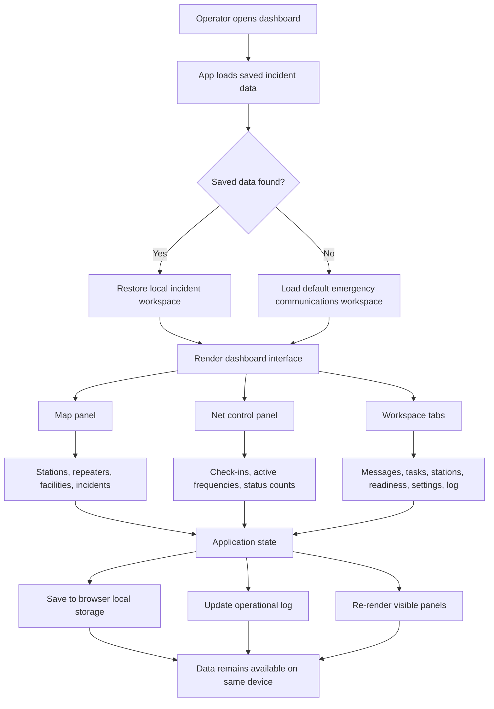

# 9M2PJU Amateur Radio EmComm Dashboard

An emergency communications dashboard for amateur radio operators, built as a browser-based single-page app for net control, field coordination, message handling, mapping, readiness tracking, and incident logging.

## Features

- Live operations map with stations, repeaters, facilities, and incidents.
- Net control check-in list.
- Editable station, callsign, net, incident, and message-number settings.
- Frequency and channel plan with active, standby, and canceled states.
- Message handling table with precedence, handling, delivery state, text, and operator tracking.
- Tasking board for field assignments.
- Station directory and readiness tracking.
- Operational log.
- Local browser storage, JSON import/export, and service worker caching.

## Emergency Communications Notes

The dashboard is designed around common IARU emergency telecommunications practices: clear net control identity, formal message numbering, precedence/handling state, traffic status tracking, resource readiness, and an auditable operational log.

This app supports operations; it does not replace your national society guidance, local served-agency SOPs, licensing requirements, or emergency manager instructions.

## How The App Was Built

The dashboard is built as a lightweight Vite application using plain JavaScript, CSS, and HTML. The design keeps the operational logic close to the browser so the app can run quickly, store data locally, and remain useful during unreliable connectivity.

The map layer is powered by Leaflet with OpenStreetMap tiles. Leaflet handles the interactive map, marker placement, popups, and geographic display, while the app manages the emergency communications data attached to each marker. Stations, repeaters, facilities, and incidents are treated as operational objects rather than simple pins.

The interface is organized around a few major work areas: the map panel, the net control side panel, and the lower workspace tabs. Each area reads from the same application state, so a change in one part of the dashboard can update the rest of the view. For example, adding an urgent incident marker affects the map, the marker summary, the urgent count, and the operational log.

Data persistence is handled in the browser with local storage. This allows an operator to keep an incident workspace available on the same device without needing a backend server. The app also supports JSON import and export so an operator can save, move, or restore operational data when needed.

The service worker adds offline support for the app shell and static assets. After the first successful load, the dashboard can still open with its interface and saved local data. Live map tiles depend on network access unless those tiles are already cached by the browser.

## How It Works

The dashboard starts with a default incident structure containing station settings, marker layers, check-ins, frequencies, formal messages, tasks, readiness items, and an operational log. The user can load demo data, start a new incident, or continue from locally saved data.

When an operator changes something, the app updates its internal state, saves the new state locally, and re-renders the affected views. This keeps the dashboard responsive without requiring a database connection. The operational log records important actions so the station has a trace of what happened during the net or incident period.

## Operational Flow

The map provides the geographic picture. Stations show where operators or teams are located. Repeaters identify available infrastructure. Facilities mark shelters, command posts, hospitals, staging areas, or other useful locations. Incidents mark field reports or problem areas that need attention.

The net control panel gives the operator a fast summary of the current net: checked-in stations, urgent items, open tasks, storage state, active net identity, control station, and working frequencies. This is meant to support the person running the frequency, who needs quick status without digging through multiple screens.

The message handling area is for formal traffic. Messages include numbering, precedence, origin station, check, frequency, addressee, signature, message text, and status. This helps keep traffic organized and auditable during busy operations.

The task board tracks assignments such as field checks, repeater verification, supply requests, and situation reports. The readiness area tracks equipment, power, forms, and other resources. The station directory keeps operator and station details close to the incident workspace.

The settings area controls station identity, net name, callsign, location, frequency, message numbering, and related operating details. These settings feed other parts of the dashboard so forms, summaries, and labels stay consistent.

## Data Model

The app uses a single local incident data model with these main sections:

- `settings`: callsign, operator, net, location, message numbering, and operating notes.
- `markers`: map objects for stations, repeaters, facilities, and incidents.
- `checkins`: stations currently participating in the net.
- `frequencies`: active and standby channels used during the operation.
- `messages`: formal traffic records and delivery states.
- `tasks`: operational assignments and their progress.
- `readiness`: equipment, supplies, and preparedness checks.
- `log`: timestamped operational history.

This structure keeps the app simple and portable. The same data model can be rendered on screen, saved locally, exported as JSON, or restored later.

## Notes

The dashboard uses Leaflet and OpenStreetMap tiles. The app shell and entered data work offline after first load, while new map tiles require network access unless already cached by the browser.
